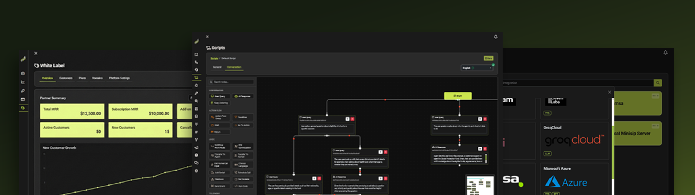

  Во имя Аллаха, Милостивого, Милосердного. 
  Вся хвала принадлежит Ему.

  

  <em>"Читай, во имя Господа твоего!"</em>

  <a href="./README.md"><b>English</b></a> &nbsp; • &nbsp;
  <a href="./README.ar.md"><b>العربية</b></a> &nbsp; • &nbsp;
  <a href="./README.cn.md"><b>中文</b></a> &nbsp; • &nbsp;
  <a href="./README.ru.md"><b>Русский</b></a>

  <a href="https://app.iqra.bot"><b>Iqra Cloud</b></a> &nbsp; • &nbsp;
  <a href="https://docs.iqra.bot"><b>Документация</b></a> &nbsp; • &nbsp;
  <a href="https://docs.iqra.bot/developers/self-hosting"><b>Self Hosting</b></a> &nbsp; • &nbsp;
  <a href="https://www.badal.om"><b>Badal Technologies</b></a>

  
  
  
  
  

> [!WARNING]  
> **Уведомление о пре-релизе (v0.1 Ожидается)**  
> Эта кодовая база активна, но требует ручной настройки сервисов. Скрипты автоматического заполнения базы данных (seeding) ожидают официального релиза v0.1. Разработчики могут изучать архитектуру, но для продакшн-развертывания пока требуется ручная настройка БД.

# Динамический Движок AI-First

**Iqra AI** — это инфраструктура оркестрации, созданная для преодоления разрыва между хаосом LLM и надежностью бизнес-кода. Она позволяет создавать сверхчеловеческих голосовых и диалоговых агентов, которые мыслят динамически, но действуют систематически.

В отличие от стандартных "оберток", Iqra AI предоставляет **Слой Детерминированной Логики** наряду с вероятностной природой AI. Мы ставим архитектуру выше "магии", давая вам глубокий контроль над задержкой через мультирегиональную маршрутизацию, нативную поддержку мультиязычности для культурной точности и строгие инструменты комплаенса для корпоративного внедрения.

## Варианты Развертывания

### 1. Iqra Cloud (SaaS)
Полностью управляемая, готовая к продакшену платформа. Включает многопользовательскую систему биллинга, управление White Label и управляемое масштабирование инфраструктуры.
[Начать разработку](https://app.iqra.bot)

### 2. Self-Hosted (Open Source)
Запускайте основной движок на собственной инфраструктуре. Эта версия включает полный движок агента, конструктор скриптов и систему FlowApp, но исключает коммерческие модули биллинга и White Labeling.
**Требования:** .NET 10 Runtime, MongoDB, Redis, Milvus, RustFS (S3).
[Читать руководство по развертыванию](https://docs.iqra.bot/developers/self-hosting)

### 3. Enterprise
Для крупных организаций, требующих выделенной инфраструктуры, индивидуальных SLA, поддержки локальной установки (on-premise) или специфических требований комплаенса (например, резидентура данных в конкретных странах GCC).
[Связаться с отделом продаж](https://www.iqra.bot/ru/contact)

---

## Движок

Iqra AI построена на архитектуре "Bring Your Own Everything", разработанной для технической масштабируемости.

### 1. [Визуальная IDE](https://docs.iqra.bot/build/script)
Графический редактор **No-Code**, который не жертвует глубиной. Будучи доступным для не-инженеров, он открывает гранулярный контроль над системными промптами, состояниями переменных и определениями инструментов. Он позволяет оркестрировать логику, настраивать интеллект и отлаживать разговоры в единой студии без переключения контекста.

### 2. [Детерминированная Логика](https://docs.iqra.bot/build/script/action-flows)
Встраивайте строгие, пошаговые **Воркфлоу** прямо в разговор. Подобно движку визуальной автоматизации, работающему внутри вашего агента, этот слой обрабатывает условную маршрутизацию (If/Else), циклы и математические операции детерминировано. AI управляет разговором; Система управляет логикой исполнения.

### 3. [Нативная Мультиязычность (Параллельные Контексты)](https://docs.iqra.bot/build/multi-language)
Слои перевода создают двойную задержку и теряют культурные нюансы. Iqra AI запускает параллельные стеки логики. Агент может мгновенно переключиться с английской "Профессиональной" персоны (используя Deepgram) на арабскую "Гостеприимную" персону (используя Azure Speech) посреди предложения, загружая совершенно другую нейронную конфигурацию.

### 4. Глобальная Edge Сеть (Мультирегиональность)
Создана для горизонтального масштабирования. Вы можете развернуть отдельные экземпляры **Iqra Proxy** и **Backend** в географически разрозненных кластерах (например, узлы Kubernetes в US-East против EU-Central). Система маршрутизирует сессии на ближайший вычислительный узел для минимизации задержки RTP и борьбы с физикой.

### 5. [Глубокие Интеграции](https://docs.iqra.bot/build/tools)
Модульная архитектура **Bring Your Own Model (BYOM)**. Мы предоставляем нативные, оптимизированные адаптеры для лидеров индустрии (OpenAI, Azure, Gemini, Anthropic, Groq, ElevenLabs, Deepgram), но абстрактный интерфейс позволяет легко подключать кастомные дообученные модели или локальные точки вывода.

### 6. [Безопасные Сессии (PCI-DSS)](https://docs.iqra.bot/build/script/secure-sessions)
Сохраняет контроль над приватным контекстом. Наша функция **Безопасных Сессий** создает "Чистую Комнату" для сбора чувствительных данных. Аудио/DTMF обрабатывается детерминированным движком через строгие **правила Get/Set переменных**. AI никогда не видит сырые цифры, только результат валидации, обеспечивая соответствие стандартам конфиденциальности данных.

### 7. Омниканальное Развертывание
Один мозг, много тел. Развертывайте агентов через стандартный SIP Trunking (Twilio, Telnyx, Vonage) или полностью обойдите PSTN, используя наш высокопроизводительный шлюз **WebRTC/WebSocket** для интеграции с браузерами и мобильными приложениями с задержкой менее секунды.

### 8. [Система FlowApps](https://docs.iqra.bot/developers/flowapp)
Открытая **Система Плагинов**, абстрагирующая внешние API. Разработчики могут написать коннекторы на C#/.NET один раз, определить схему и позволить конечным пользователям визуально настраивать учетные данные и параметры (например, Cal.com, HubSpot), устраняя необходимость в повторяющемся написании скриптов для кастомных HTTP инструментов.

### 9. [Умная Смена Очереди](https://docs.iqra.bot/build/agent/interruption)
Дайте пользователю полный контроль над пайплайном прерывания. Движок позволяет выбирать между стандартным **VAD** (Voice Activity Detection), моделями проекции на основе **ML** или принятием решений на основе **LLM** для точного различия между паузой, обратной связью ('угу') и настоящим вклиниванием.

### 10. White Labeling (Только Cloud)
Комплексная система для Агентств для перепродажи платформы. Полный ребрендинг панели управления с вашим логотипом, кастомным доменом и определение собственной структуры ценообразования для ваших клиентов.

---

## Вклад в развитие

Мы приветствуем вклад в основной движок, интеграции и экосистему FlowApp.
Пожалуйста, прочитайте наши [Руководящие принципы участия](./CONTRIBUTING.md) перед отправкой Pull Request.

## Безопасность

Мы серьезно относимся к безопасности нашей платформы и наших пользователей.
Если вы обнаружили уязвимость, пожалуйста, не сообщайте о ней через GitHub Issues.
Пожалуйста, прочитайте нашу [Политику Безопасности](./SECURITY.md) для получения полных инструкций по раскрытию информации.
Пишите нам напрямую: **security@iqra.bot**

## Лицензия и Условия

Iqra AI лицензирована под пользовательской **Source-Available License**.

*   **Разрешено:** Личное использование, внутреннее бизнес-использование и использование агентствами (ручное управление клиентами).
*   **Запрещено:** Вы **не можете** использовать эту кодовую базу для создания конкурирующей публичной SaaS-платформы.
*   **Этический пункт:** Применяются строгие ограничения использования в отношении политического и этического соответствия.

Пожалуйста, ознакомьтесь с полной [ЛИЦЕНЗИЕЙ](./LICENSE.md) перед использованием или распространением этого программного обеспечения.

## Благодарности

Особая благодарность проектам с открытым исходным кодом, которые вдохновили нашу архитектуру и дизайнерские решения:
*   [Typebot.io](https://typebot.io)
*   [Dify.ai](https://dify.ai)
*   [Scriban](https://github.com/scriban/scriban)